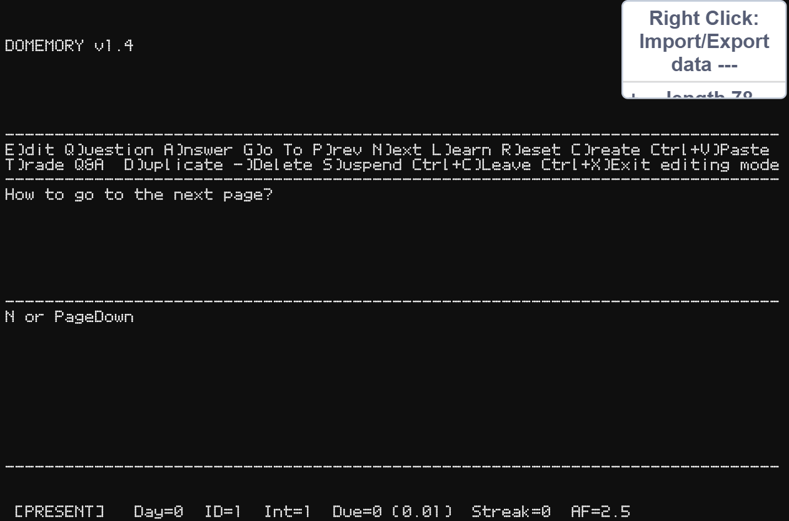
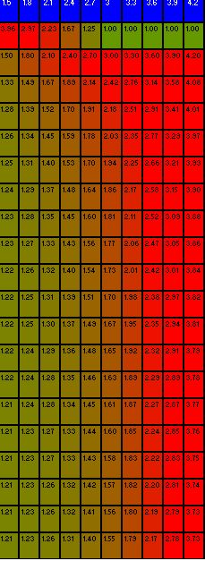

# iush

**LINK: https://iamdominic2.github.io/iush/**

It stands for ***i***nteractive ***u***ser ***sh***ell, in honor of my best friend at school Aayush.

Supported commands: `cd pwd c: dir md rd set write copy del echo cls date time color help exit find`

Built-in programs:
c:\program\matrixrain.exe
c:\program\notepad.exe (Command: `Notepad \[optimal: file\]` )
c:\program\paint.exe (Command: `Paint \[optimal: file\]` )
c:\program\regedit.exe (Command: `Regedit`)

Command-line emulator built from scratch in Scratch - stretching it to the limits, and scratching my head on why anyone would actually (*except me*) bother to do this.

*(Note that alternative drives are not supported for now. Experiment with it at your own risk.)*
 
### Command line basics
1. No news is good news! Rather, it's like a teacher - if the shell starts talking back to you, you know you done something wrong.
2. Use the mouse to copy text (your clipboard will be shown in the square brackets \[\] at the bottom of the page), and Ctrl+V to paste it back! (*Note that Ctrl+C **aborts** the currently running command)
3. Use `&` to chain commands together!
4. (*Unique to iush*) However, if you want to **literally** have "&", for instance when using `set` in a file to execute as a batch later, add `#LITERAL&` (**exact phrasing**) to the end of your command.
5. *Hint*: To avoid re-inputting previous commands, use the *Up Arrow* to pre-input previous commands (and the *Down Arrow* if you overshoot)! It even works multiple times!

## Domemory
Classic spaced repetition active recall - Maybe the first of its kind on Scratch! For students and learners alike, if you are too lazy to install Anki, you can do it straight from the Browser!

* Pre-trained SuperMemo 5 algorithm (SuperMemo 2 was too boring to code!)
* No modern corporate "gamification" bloat - focus purely on the pragmatism of self-testing!
* With just 1.8MB of code (plus the size of the text files you will export), cherish the wisdom of your new knowledge! This is one of the most important inventions of all time, and the possibilities are nearly endless, so have fun! 

* SM-5 optimal factor matrix derived from about 19,000 repetitions: of me using SuperMemo itself: 

### Bug fixes of Domemory
1.1: Wrong linear interpolation bug fixed, freeze on G + Item #0 (underflow bug) fixed
1.2: Undesirible registeration of "q" and "a" into text fields when using them as quick triggers to edit fixed.
1.3: Integration into iush, with a command to exit,  remapped some keybinds like Delete to "-" to account for the fact that some keyboards don't have such physical keys, fixed broken Optimal-factor matrix

***Note: Domemory save data is stored seperately to the file system, and only lost on Reload.***

## Notepad
A text editor. The good thing about this is that you can make newline, unlike the terminal's "set" command.
Try this command: *notepad c:\readme.txt
The keyboard shortcuts are chosen specifically to not clash with the browser. I originally planned *Ctrl+Shift+A* for **Save As**, however Chrome recently added a "Search tabs" option that has this exact shortcut, so I remapped it to Ctrl+A. Sorry if it breaks your muscle memory, please forgive me *lol*

## Paint
A painting program with 22 different colors. Note that to prevent massive file sizes and extreme lag, I had to make the pixels somewhat big, however it is still usable to an extent. 
***HINT***: If you hate the fact that it's in `terminal black`, and would like it to look more "light mode" paper candy, a single keystroke of W will do the trick!
**FUN FACT**: It saves as english letters: `0` for black, `a`-`u` for colors.

## Regedit
A program allowing you to edit the name and data of registry members. In other operating systems, the file system is quite abstracted from the registry, however in this one it is combined into one: the **`Name`s** and the **`Data`s**.
***WARNING***: There is no "Undo" if you mess up a Name or a Value. Better to `Export` the Registry Member Lists just to be on the safe side. (More on that later.)

### Experiment!
Opening text files in Paint will result in some weird colors due to the bitmap conversion, and vice versa.

## Importing & Exporting
I cannot force-download files to your computer, so if you want to save, Type in `regedit`, and right click -> Export **BOTH** the `Name` and `Data` lists. When you re-load, type in `regedit` again and right click -> Import **BOTH** the lists correspondingly.
Again, **NOTE THAT** Domemory save data is **seperate**. It originally was a *seperate program* of mine, but I realized it had the terminal-type vibe so I re-added it here, so that you can do your repetitions with an operating-system emulator.

#### Have fun with the `iush` terminal! :)

